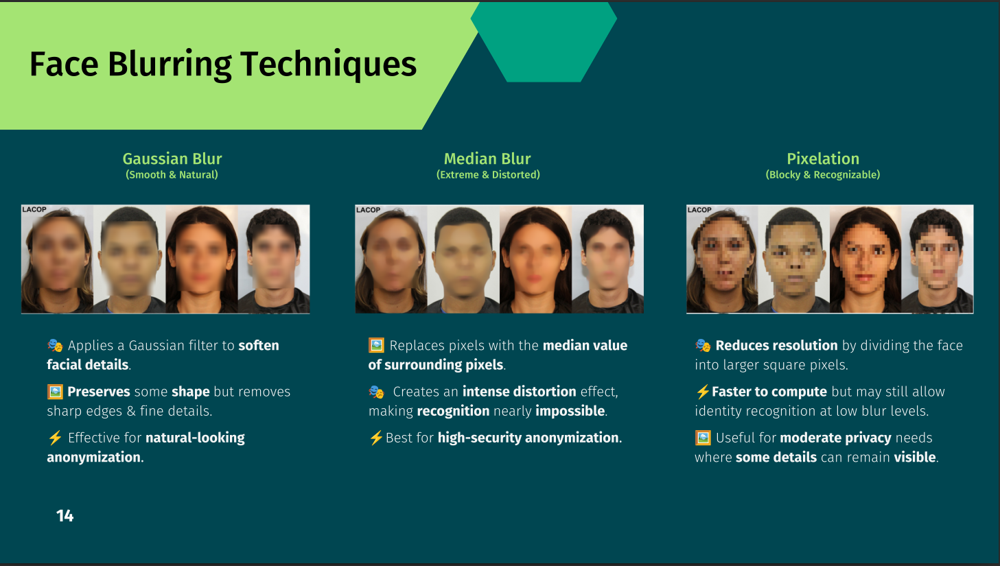
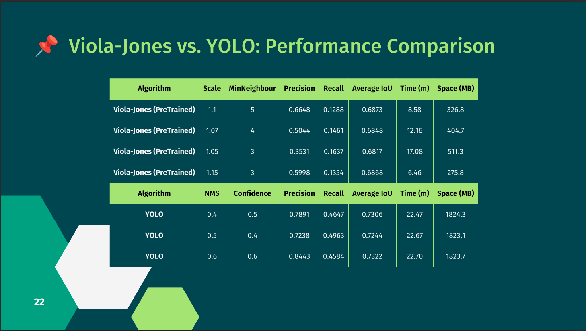

<!-- ========================================================= -->
<!-- HERO -->
<!-- ========================================================= -->
<p align="center">

# 🎭 Face Privacy
### Real-Time Face Detection & GDPR-Compliant Face Anonymization

### Comparing Classical Computer Vision with Modern Deep Learning


</p>

<p align="center">


</p>

---

## 🚀 Overview

This project explores **privacy-preserving face anonymization** by comparing a traditional Computer Vision algorithm (**Viola-Jones**) with a modern Deep Learning detector (**YOLO**).

The repository includes:

- 🔍 Face detection
- 🎭 Face anonymization
- 📊 Performance benchmarking
- 🧠 Custom-trained Viola-Jones model
- 🎥 Image & video processing
- 📈 Experimental comparison on the WIDER FACE dataset

The primary goal is to understand the **trade-off between detection accuracy, computational cost and real-time performance**.

---

# ✨ Features

- ✅ Real-time face detection
- ✅ YOLO implementation
- ✅ Custom-trained Viola-Jones classifier
- ✅ Gaussian Blur
- ✅ Median Blur
- ✅ Pixelation
- ✅ Image processing
- ✅ Video processing
- ✅ WIDER FACE benchmarking
- ✅ Precision / Recall / IoU evaluation
- ✅ Processing time comparison

---


# 🏗 Project Pipeline
```
Input Image / Video
          │
          ▼
 Face Detection
 ├── Viola-Jones
 └── YOLO
          │
          ▼
 Face Localization
          │
          ▼
 Blur Engine
 ├── Gaussian
 ├── Median
 └── Pixelation
          │
          ▼
 Privacy Protected Output
```
---

# 🔬 Algorithms

## 🎻 Viola-Jones

A classical Haar Cascade detector optimized for CPU execution.

### Strengths

- ⚡ Extremely fast
- 💻 CPU friendly
- 🪶 Low memory usage

### Weaknesses

- ❌ Sensitive to lighting
- ❌ Poor robustness to occlusions
- ❌ Lower recall on difficult datasets

---

## 🤖 YOLO

A modern Deep Learning detector capable of robust face localization.

### Strengths

- 🎯 High accuracy
- 👥 Excellent multi-face detection
- 🌙 Robust under challenging conditions

### Weaknesses

- 🖥 Requires GPU for real-time inference
- 💾 Higher memory consumption

---

# 🎭 Face Anonymization Techniques

<p align="left">

</p>

| Technique | Description | Speed | Privacy |
|------------|------------|--------|---------|
| Gaussian Blur | Natural-looking anonymization | ⭐⭐⭐⭐ | ⭐⭐⭐ |
| Median Blur | Strong distortion | ⭐⭐⭐ | ⭐⭐⭐⭐⭐ |
| Pixelation | Block-based anonymization | ⭐⭐⭐⭐⭐ | ⭐⭐⭐ |

---

# 📊 Benchmark

The algorithms were evaluated on the **WIDER FACE** validation dataset.

Metrics include:

- Precision
- Recall
- IoU
- Processing Time
- Memory Usage

---

## Benchmark Results


| Algorithm | Precision | Recall | IoU | Time |
|------------|----------|--------|------|------|
| Viola-Jones | 0.6648 | 0.1288 | 0.6873 | 8.58 min
| YOLO | 0.8443 | 0.4584 | 0.7322 | 22.70 min

<p align="left">

</p>

---

# ⚙ Installation

Clone the repository

```bash
git clone https://github.com/<username>/<repository>.git

cd <repository>
```

Install dependencies

```bash
pip install -r requirements.txt
```

---

# 🚀 Quick Start

Launch the notebook

```bash
jupyter notebook
```

Open

```
notebook/face_blur.ipynb
```

The notebook provides a complete walkthrough of:

- Loading YOLO
- Loading Viola-Jones
- Running face detection
- Applying blur techniques
- Processing videos
- Benchmarking

---

# 📥 Dataset

The benchmark uses the **WIDER FACE** dataset.

Extract the validation images into

```text
WIDER_val/
```

The testing scripts automatically use this directory.

---

# 🧪 Experimental Setup

Dataset

- WIDER FACE Validation Set

Evaluation Metrics

- Precision
- Recall
- IoU
- Processing Time

Benchmark Tool

- Runlim

---

# 💡 What I Learned

This project allowed me to gain practical experience with:

- Classical Computer Vision
- Haar Cascade training
- OpenCV internals
- YOLO inference
- Deep Learning vs Classical approaches
- Dataset preparation
- Performance benchmarking
- Privacy-preserving AI

---

# 📚 References

- OpenCV
- YOLO
- WIDER FACE Dataset
- Runlim

---

# ⭐ Support

If you found this repository useful, consider giving it a ⭐ on GitHub.

Contributions, suggestions and discussions are always welcome.

---

<p align="center">

Made with ❤️ using Python, OpenCV and Deep Learning

</p>